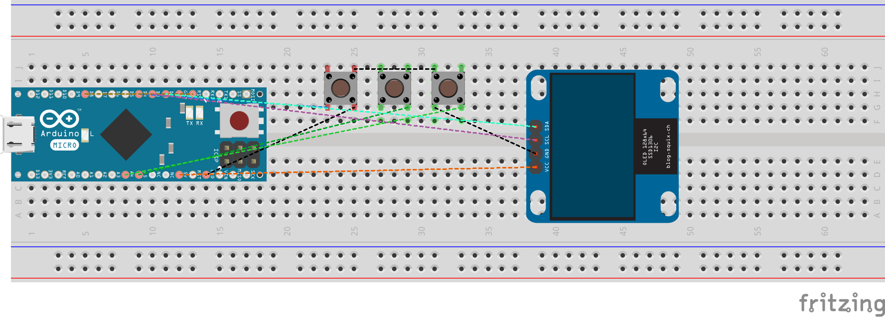
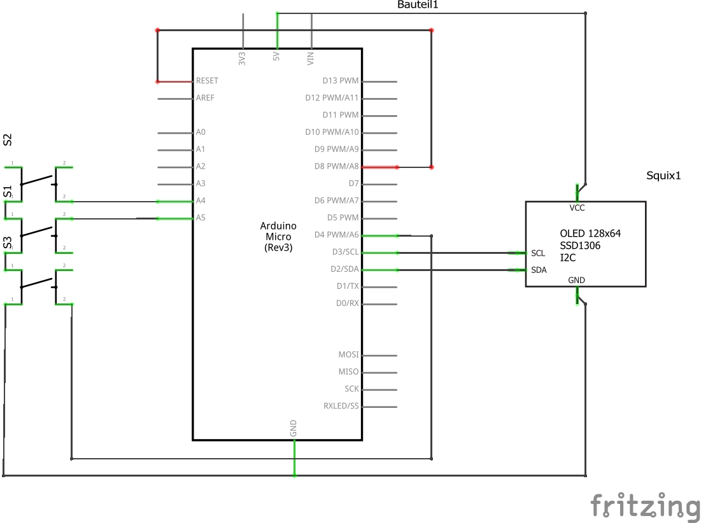

# KeyBlaster

## Introduction
The KeyBlaster is keystroke autofiring device based on a Arduino Micro which repeatedly "fires" the same keystroke which is very handy for repetitive tasks.
There are software solutions with the same use case but for e.g. applications and games like WoW are blocking these inputs.
In opposite to these software based solutions is this hardware solution with an Arduino Micro not blocked by such applications and games because it behaves as a HID device just like a regular keyboard.

## Hint
The KeyBlaster is intended to be used with a german KeyBoard driver which means that Y and Z are interchanged. In case you need this to be reverted seek the following code lines and adapt to your needs:

```
      //send BlastKey but exchange yz for german keyboard layout
      if (BlastKeys[BlastKey] == 121){
        Keyboard.print("z");
      }
      else if(BlastKeys[BlastKey] == 122){
        Keyboard.print("y");  
      }
      else {
        Keyboard.print(char(BlastKeys[BlastKey]));
      }
```

## Wiring




## License / Copyright

KeyBlaster (software & hardware) is licensed under GPL-2.0-only.

© Alexander Feuster 2022


